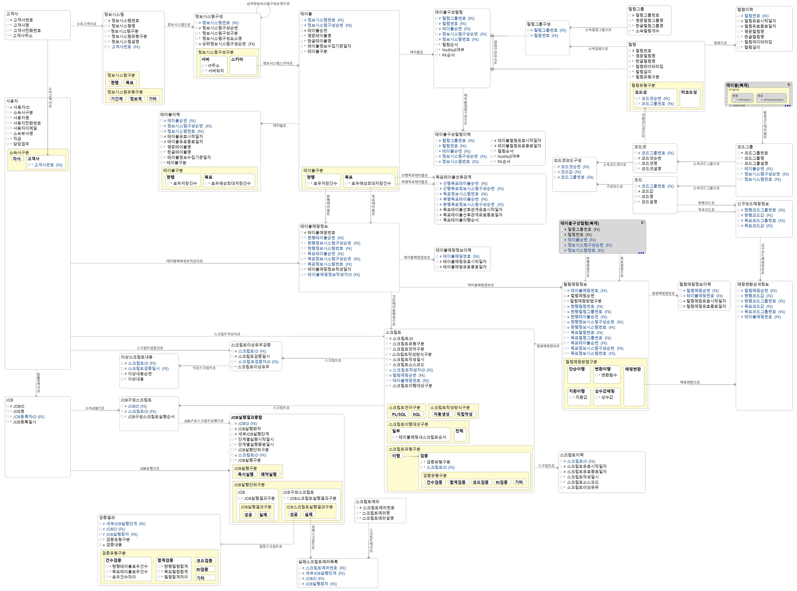
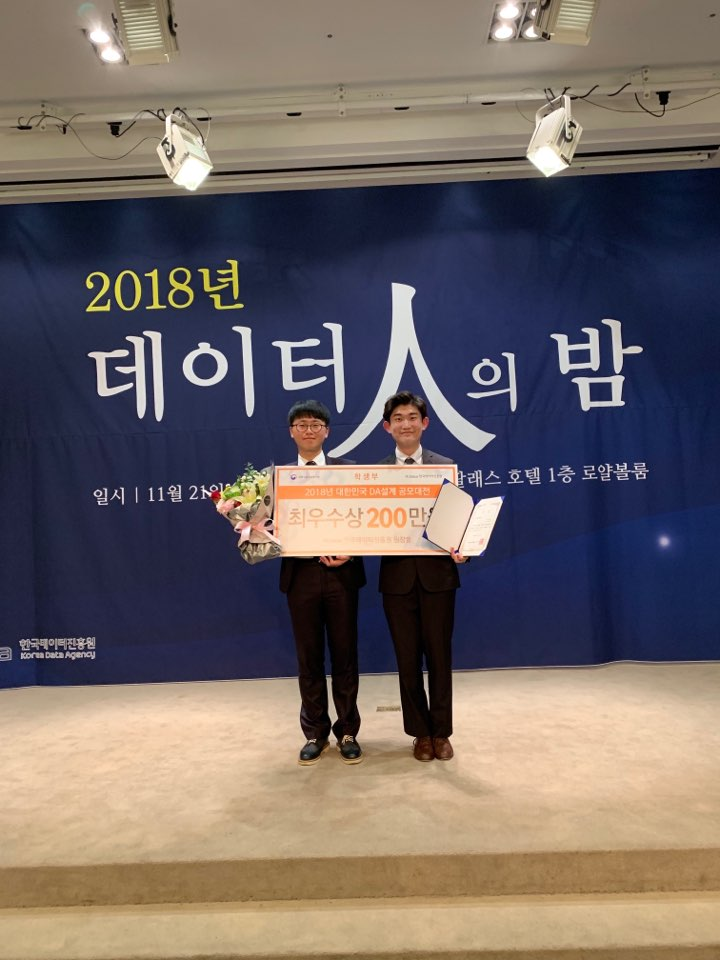
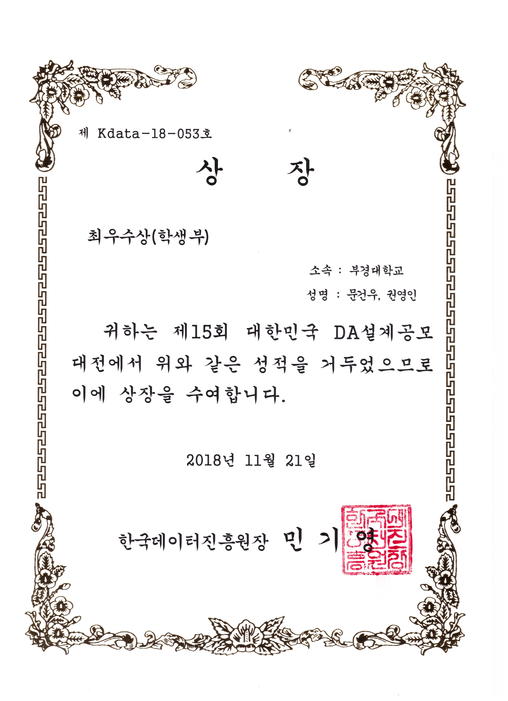

# 2018 DA 설계공모대전 최우수

### :triangular_ruler: 설계주제
차세대 데이터 마이그레이션 시스템

### :calendar: 프로젝트 수행기간
2018년 7월 ~ 2018년 10월 초

### :wrench: Tool
 - DA#5 Modeler
 - Excel

### :checkered_flag: DA 설계 결과물
 1. 요구사항분석서
 2. 논리DB설계서
 3. 데이터표준정의서
 

### :thought_balloon: 프로젝트 후기

 이번 프로젝트를 통해 나는 새로운 갈림길에서 나아가야할 방향과 새로운 동료들을 찾았다. 컴퓨터공학을 2017년도 2학기부터 시작했고 2018년도 1학기까지 끝냈을 무렵 나는 "데이터"라는 것이 궁금해졌었다. 그에 일환으로 18년도 1학기 중에 진행했던 "Datacamp"를 통한 python을 활용한 데이터분석이었다. 이로 인해 경영학과에서 알게 된 후배와 함께 컴퓨터공학과의 Datapia라는 동아리의 하계스터디에 참여하게 되었다.
 
 그런데 "분석"을 하려고 했는데 흐름이 뭔가 이상하게 흘러갔다. 분석을 하기 전에 "기본"을 탄탄히 하는게 좋다며, 데이터베이스 그리고 데이터베이스 설계에 대해 스터디를 진행했다. 스터디의 최종 목표는 해당 공모대전에 출품하는 것이었다. 1학기를 보내며 이번 대회의 포스터를 여러번 보았고 이런 경험을 해보는 것도 좋은 기회가 될 것이라고 생각했다. 그래서 난 이왕하는거 더 열심히 해보기로했다. 왜냐하면 설계라는 분야가 경영학과에서 진행했던 공모전을 위한 기획서 작성과 유사한 분석적이고 이를 기반으로 한 논리적인 능력이 중요해보였기 때문이다.

 그리고 그 결과로 동아리 내 17년도 공모대전에 참여 경험이 있는 컴퓨터공학과 학생과 함께 팀을 꾸렸다. 그 친구가 나를 뽑은 이유는 "열심히 하는 것 같아서"였다. 같이 프로젝트를 진행하며, 친구의 상대적인 설계에 대한 역량이 더 있어보였다. 왜냐하면 나의 설계에 대한 주장에 대해 학문적인 지식을 바탕으로 적절한 논리를 펼쳤기 때문이다. 그때마다 한편으로는 오기도 있어서 어떻게 하면 내 주장을 관철할 수 있을까라는 생각을 많이했다. 하지만 이는 협업의 목표와는 거리가 멀다는 것을 알게되었고, 나는 좀 더 특이하게 발생할 수 있는 상황들을 제시하며 다른 관점의 의견을 내기로 결심했다. 그렇게 다양하고 많은 의견을 바탕으로 올바른 정답으로 다가가는 과정이 진행되며 팀이 올바른 방향으로 가고 있다는 것을 깨달았으며, 기본적인 많은 것들을 배워가는 시간이 되었다.

 결과적으로는 해당 프로젝트에서 2등인 최우수상을 받았다. 같이 하던 팀원이 1등이 되지 못한 설움을 표현할 때 많은 도움을 주지 못함에 나도 많이 안타까웠다. 조금 더 신경썼더라면 결과는 달라졌을까라는 생각과 함께 말이다. 
 
 해당 프로젝트를 통해 어플리케이션 및 다양한 서비스의 기반이 되는 "데이터"의 인사이트를 얻고 협업하며 의사소통 방법에 대해 배울 수 있는 좋은 기회가 되었다.

